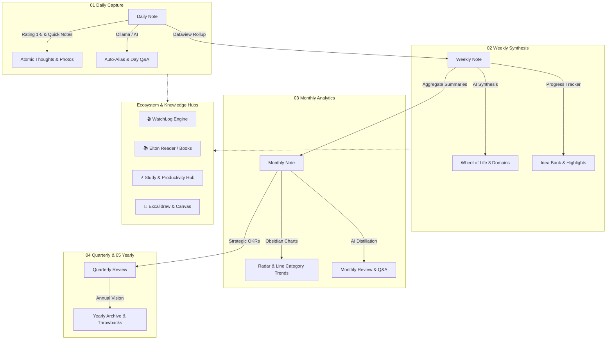

<div align="center" id="top">

# 🪐 PANDORA'S VAULT
### *The Ultimate AI-Augmented Second Brain & Digital Life Operating System*

[](https://obsidian.md)
[](https://github.com)
[](https://ollama.ai)
[](https://github.com)
[](LICENSE)
[](https://github.com)

<br>

<p align="center">
  <b>Pandora’s Vault</b> is a state-of-the-art, fully autonomous Personal Knowledge Management (PKM) and Life Operating System built for <b>Obsidian</b>.<br>
  Engineered with a seamless blend of <b>multi-tier periodic retrospectives</b>, <b>local on-device LLM intelligence</b>, <b>entertainment and book logging</b>, and an <b>ultra-clean cyberpunk AMOLED aesthetic</b>.
</p>

<p align="center">
  <a href="#-core-pillars">Core Pillars</a> •
  <a href="#-system-architecture">Architecture</a> •
  <a href="#-vault-structure">Vault Structure</a> •
  <a href="#-deep-dive-feature-highlights">Feature Highlights</a> •
  <a href="#-aesthetic--styling-engine">Aesthetics</a> •
  <a href="#-community-plugins-matrix">Plugins Matrix</a> •
  <a href="#-quickstart-guide">Quickstart</a> •
  <a href="#-credits--acknowledgements">Credits</a>
</p>

---

</div>

<br>

## 🌌 Overview & Philosophy

Most productivity vaults are either too rigid to sustain or too unstructured to be useful. **Pandora's Vault** merges the best of both worlds:
1. **Periodic Hierarchy (Time Garden):** A cohesive journaling pipeline connecting atomic daily thoughts to multi-year life visions.
2. **Private Local AI Agents:** On-device summarization, auto-aliasing, and sentiment/balance ratings powered by local models (Phi-4, DeepSeek-R1, Mistral) via Ollama with zero cloud data leaks.
3. **Dedicated Lifestyle Hubs:** Built-in engines for tracking movies, TV series, anime, reading progress, study sessions, and habit tracking.
4. **Immersive Aesthetic:** A true black AMOLED visual framework with custom pixel art headers, interactive Meta-Bind buttons, animated widgets, and ambient constellation overlays.

---

## ⚡ Core Pillars

<table>
  <tr>
    <td width="50%">
      <h3 align="center">🌿 Time Garden OS</h3>
      <p align="center">Multi-tiered journaling system spanning <b>Daily ➔ Weekly ➔ Monthly ➔ Quarterly ➔ Yearly</b> notes with automated throwbacks, Dataview rollups, and dynamic rating aggregators.</p>
    </td>
    <td width="50%">
      <h3 align="center">🤖 Local LLM Automation</h3>
      <p align="center">Privacy-first AI intelligence via <b>Ollama</b> and <b>OpenRouter</b>. Auto-generates descriptive aliases, daily reflections, weekly Wheel-of-Life scores, and interactive note Q&A.</p>
    </td>
  </tr>
  <tr>
    <td width="50%">
      <h3 align="center">🎬 WatchLog & Book Library</h3>
      <p align="center">Complete entertainment & reading tracking ecosystem. Catalog anime, movies, TV series, and books with live progress bars, IMDb metadata, and highlight extraction.</p>
    </td>
    <td width="50%">
      <h3 align="center">🎨 AMOLED & Pixel Art Aesthetics</h3>
      <p align="center">Bespoke <b>Vanilla AMOLED</b> dark theme, responsive pixel-art banner configurations, custom callouts, Star-View constellation canvas, and Meta-Bind interactive buttons.</p>
    </td>
  </tr>
</table>

---

## 📐 System Architecture

The lifecycle of knowledge in Pandora's Vault flows upward from raw daily capture into structured retrospectives, assisted at every stage by DataviewJS scripts and autonomous AI summarizers:



---

## 🗂️ Vault Structure

```text
Pandoras-Vault/
│
├── 📂 00 Dashboard/               # Vault Command Center & Welcome greeting
│   └── 📄 Welcome.md               # Quick launchpad & documentation hub
│
├── 📂 01 Daily/                   # Daily atomic notes (YYYY-MM-DD-dddd)
├── 📂 02 Weekly/                  # Weekly synthesis & habit trackers (YYYY-[W]WW)
├── 📂 03 Monthly/                 # Monthly performance dashboards (YYYY-MM-Month)
├── 📂 04 Quarterly/               # Quarterly milestones & OKR reviews (YYYY-Q#)
├── 📂 05 Yearly/                  # Annual reviews & life trajectory (YYYY)
│
├── 📂 06 Templates/               # Modular template engine & scripts
│   ├── 📂 Components/             # 84+ reusable Meta-Bind, chart & AI widgets
│   ├── 📂 Images/                 # Pixel-art banners (GuttyKreum) & media assets
│   ├── 📂 Parents/                # Master note templates (Daily, Weekly, Note...)
│   └── 📂 Scripts/                # JS execution pipeline (Ollama API, DataviewJS)
│       ├── 📂 api/                # Ollama & schema connectors
│       ├── 📂 operations/         # Daily, weekly, monthly, yearly lifecycle ops
│       ├── 📂 services/           # AI services (qa, alias, summary, wheelOfLife)
│       ├── 📂 templater/          # DataviewJS rating & wheel-of-life charts
│       └── 📂 utils/              # Data parsing, chunking & UI helpers
│
├── 📂 07 Notes/                   # Evergreen Zettelkasten & permanent knowledge
│
├── 📂 WatchLog/                   # Universal entertainment tracking OS
│   ├── 📂 Animation/              # Animated films & western animation
│   ├── 📂 Anime/                  # Japanese anime series & films
│   ├── 📂 Korean TV Show/         # K-Dramas & variety shows
│   ├── 📂 Movie/                  # Feature films with IMDb metadata & poster art
│   ├── 📂 Reading/                # Reading logs & books
│   └── 📂 TV Show/                # Television series & season trackers
│
├── 📂 books/                      # Elton Reader library & knowledge extractions
│   ├── 📂 book/                   # EPUB/PDF metadata & reader configs
│   ├── 📂 bookNote/               # Comprehensive book summaries & takeaways
│   └── 📂 highlights/             # Extracted book highlights & quotes
│
├── 📂 Excalidraw/                 # Infinite whiteboard vector diagrams
├── 📂 pixel-banner-images/        # Curated aesthetic banners for cards & notes
├── 📄 reading-progress.json       # Real-time synchronization for book tracking
└── 📄 *.canvas                    # Obsidian visual canvas mind maps
```

---

## 🚀 Deep Dive: Feature Highlights

### 1. 🪐 The Time Garden Periodic System

<details>
<summary><b>Click to expand Periodic Journaling Details</b></summary>
<br>

* **Daily Notes:**
  * **Dynamic Navigation Bar:** Meta-Bind buttons to jump across days, weeks, and months instantly.
  * **Smart Alias Input:** Interactive frontmatter editor directly inside the note view.
  * **Day Rating (1–5 Stars / Slider):** Real-time daily score saved straight to metadata.
  * **Memory Throwbacks:** Automatically surfaces past memories from 1 year ago.
  * **Photo Grid & Quick Notes:** Pre-styled dropzones for media and atomic ideas.

* **Weekly Notes:**
  * **Automatic Daylist Aggregation:** DataviewJS dynamically pulls daily aliases, ratings, and tasks into a single view.
  * **Rating Bar Chart:** Visual bar graph comparing day ratings across all 7 days.
  * **Interactive Capture Zones:** Structured sections for *Progress Made*, *Ideas Born*, and *Highlights*.
  * **AI Wheel of Life:** Evaluates your week across 8 key dimensions with qualitative analysis.

* **Monthly & Quarterly Notes:**
  * **Category Trend Charts:** Obsidian Charts rendering radar and line charts for habit consistency.
  * **Month / Quarter Rollups:** One-click summarization consolidating weekly highlights.
  * **Media & Log Retrieval:** Automated extraction of all movies watched and books finished this month.

* **Yearly Notes:**
  * **Annual Retrospective:** High-level executive summary of your entire year's evolution.
  * **Multi-Year Radar Comparison:** Macro life-balance insights.

</details>

---

### 2. 🧠 Local AI Engine (Ollama & OpenRouter)

Pandora’s Vault includes a **fully scripted, modular JavaScript AI execution pipeline** in `06 Templates/Scripts/`. Run private local models via **Ollama** or high-performance cloud endpoints via **OpenRouter**:

| Script Service | Description | Recommended Local Model |
| :--- | :--- | :--- |
| **`alias.js`** | Analyzes the day's reflection and generates a 3-phrase descriptive note title. | `deepseek-r1:1.5b` / `phi4-mini` |
| **`rating.js`** | Objectively rates your day (1–10) based on emotional state & accomplishments with an explanation. | `phi4-mini` |
| **`summary.js`** | Recursively distills daily notes into weekly, monthly, and yearly executive summaries. | `phi4` / `mistral:instruct` |
| **`qa.js`** | Allows you to "interview" your past self — chat with any specific day, week, or month! | `phi4` / `llama3.2` |
| **`wheelOfLife.js`** | Scores 8 life dimensions (*Career, Health, Relationships, Growth, Fun, Social, Finance, Spiritual*). | `phi4` |
| **`yearReview.js`** | Synthesizes an entire 365-day journey into high-impact themes and milestones. | `phi4` |

```javascript
// Example: Execute an on-demand AI Summary directly via Meta-Bind Button:
await window.timeGarden.services.summary.generateWeeklySummary(currentFile);
```

---

### 3. 🎬 WatchLog: Media & Entertainment OS

Track everything you watch with rich IMDb metadata, cast credits, poster banners, and completion percentages.

```yaml
---
title: "Interstellar"
type: "Movie"
status: "Completed"
rating: 5
progress: 100%
releaseDate: 2014-11-07
communityRating: 8.7
director: ["Christopher Nolan"]
cast: ["Matthew McConaughey", "Anne Hathaway", "Jessica Chastain"]
poster: "https://m.media-amazon.com/..."
externalLink: "https://www.imdb.com/title/tt0816692"
---
```

* 📺 **Supported Categories:** Anime, Movies, TV Shows, Animations, Korean TV Shows.
* 📊 **Smart Dashboard:** Filter by *Currently Watching*, *Completed*, *Plan to Watch*, or *Dropped*.
* 🖼️ **Poster Galleries:** Automatic visual card layout with ratings and progress badges.

---

### 4. 📚 Elton Reader & Book Knowledge System

* 📖 **In-Vault Reader:** Read e-books directly inside Obsidian with customizable typography and margins.
* 🔄 **Sync Tracker:** `reading-progress.json` tracks percentage read and time spent across your library.
* 📝 **Smart Highlights:** Extract quotes and key passages directly into atomic Zettelkasten notes in `books/highlights/`.

---

### 5. ⚡ Custom Hubs & Visual Additions

* 🎯 **Productivity Hub:** Centralized dashboard uniting daily habits, active projects, tasks, and calendar events.
* 🎓 **Study Hub:** Dedicated workspace for students with course binders, assignment checklists, and an integrated Pomodoro timer.
* ✨ **Star View:** Renders an interactive, ambient Sagittarius constellation overlay across your workspace.
* 🕸️ **Persistent Graph & Mini Graph:** Keep an interactive, floating mini-graph of linked knowledge visible at all times.

---

## 🎨 Aesthetic & Styling Engine

Pandora’s Vault is crafted for maximum visual satisfaction and minimal eye strain:

```text
🎨 Theme: Vanilla AMOLED (Pure Black #000000)
🔤 Font: JetBrains Mono / JetBrains Mono NL
✨ Highlights: Glassmorphism Callouts, Dynamic Banner Shadows, Gradient Meta-Bind Buttons
```

<details>
<summary><b>Included Custom CSS Snippets (Click to View)</b></summary>
<br>

* `banner-text-shadow.css` — High-contrast text readability over bright pixel banners.
* `calander-ui.css` — Sleek, compact calendar widget styling.
* `elton-reader-library.css` — Dark aesthetic book covers and reading interface.
* `graph-styler-neon.css` — Vibrant glowing neon graph view colors.
* `hub-colors.css` — Unified gradient palette across all Hub plugins.
* `mascot.css` — Subtle animated companion widget.
* `time-garden-daily-note-themes.css` — Unique accent color schemes for each day of the week.
* `time-garden-colored-sidebar.css` — Customized sidebar navigation icons and folders.
* `welcome-screen.css` — Clean, distraction-free new-tab dashboard.

</details>

---

## 🧩 Community Plugins Matrix

| Plugin | Role | Description |
| :--- | :--- | :--- |
| **Dataview** | Data Engine | Live JavaScript queries, task aggregations, and table rollups. |
| **Meta-Bind** | Interactivity | Interactive inputs, sliders, and action buttons embedded in markdown. |
| **Templater** | Automation | Dynamic templating and script execution on file creation. |
| **Time Garden Plugin** | Core Engine | Custom backend API exposing `window.timeGarden` and AI services. |
| **WatchLog** | Media Tracking | Entertainment tracker with poster views and episode logging. |
| **Elton Reader** | Literature | E-book reader with highlight management and progress sync. |
| **Productivity Hub** | Task Management | Unified habit, task, and project command center. |
| **Study Hub** | Academic | Course organizer with built-in Pomodoro focus timer. |
| **Obsidian Charts** | Visualization | Renders Radar, Line, and Bar charts for life-domain tracking. |
| **Obsidian Tracker** | Habit Analytics | Habit streak tracking and statistical visualizations. |
| **Excalidraw** | Whiteboarding | Vector drawing and infinite visual canvas mind-mapping. |
| **Iconic / Icon Folder**| Aesthetics | Custom icon badges on all folder trees and note headers. |
| **Star View** | Visual Ambient | Ambient Sagittarius constellation overlay on workspace. |
| **Copilot** | Chat Assistant | Embedded AI sidebar conversational interface. |

---

## 🚀 Quickstart Guide

### Prerequisites
1. **[Obsidian](https://obsidian.md)** (v1.5.0 or newer recommended)
2. **[Ollama](https://ollama.ai)** *(Optional, recommended for 100% offline AI)*
3. **[JetBrains Mono](https://www.jetbrains.com/lp/mono/)** font installed on your system.

### 1. Clone the Vault
```bash
git clone https://github.com/sohamSanat/Pandoras-Vault---Copy.git "Pandoras-Vault"
```

### 2. Open in Obsidian
1. Launch **Obsidian**.
2. Click **"Open folder as vault"**.
3. Select the cloned `Pandoras-Vault` directory.
4. When prompted, click **"Trust author and enable plugins"**.

### 3. (Optional) Set Up Local AI with Ollama
Pull the recommended lightweight models to enable AI summarization and auto-aliasing:
```bash
# High-speed daily alias model
ollama pull deepseek-r1:1.5b

# Fast reasoning & reflection model
ollama pull phi4-mini

# Comprehensive periodic summarizer
ollama pull phi4
```

---

## ⌨️ Recommended Daily Routine

```text
🌅 Morning (5 Mins)
   └─ Open 00 Dashboard ➔ Click "Today's Note"
   └─ Jot down 3 core priorities for the day in Quick Notes

🌇 Throughout the Day
   └─ Capture atomic thoughts, drop media/photos into Pictures zone
   └─ Log movies/anime in WatchLog or reading sessions in Elton Reader

🌙 Evening (5 Mins)
   └─ Adjust Day Rating slider (1-5)
   └─ Click "✨ AI Alias" to generate a descriptive 3-phrase title
   └─ (Optional) Click "🤖 Ask Note" to reflect on your day's sentiment

🗓️ Sunday Evening (15 Mins)
   └─ Open Weekly Note ➔ Click "⚡ Generate AI Summary"
   └─ Run "🎯 Wheel of Life" to view your 8-domain balance chart
   └─ Set target milestones for the upcoming week
```

---

## 🌟 Credits & Acknowledgements

* **[Karlos](https://ishortn.ink/karlos-obsidian-tutorials)** — Creator of the original *Time Garden* Obsidian journaling framework and ambient audio.
* **[GuttyKreum](https://guttykreum.itch.io/)** — Gorgeous pixel-art banners from the *Japan Collection Vol. 2 & 3*.
* **[BogdanS](https://github.com)** — Author of the *WatchLog* media tracking plugin.
* **Caspar David Friedrich** — *Wanderer above the Sea of Fog* (Yearly banner artwork).
* **Obsidian Community** — Creators of Dataview, Meta-Bind, Templater, and Excalidraw plugins.

---

<div align="center">

### Crafted with ❤️ for Knowledge Seekers & Thinkers

⭐ **Star this repository if you find it helpful!**

<br>

<a href="#top">
  
</a>

</div>
